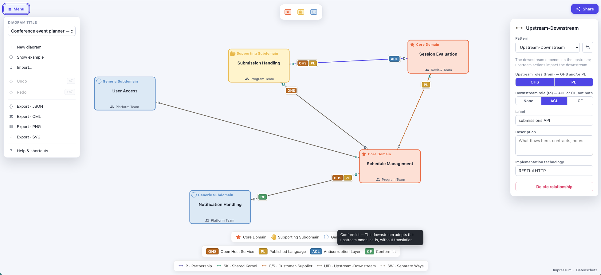

# Context Maps Modeler

[](LICENSE)
[](https://github.com/Miragon/context-maps-modeler/actions/workflows/ci.yml)
[](https://www.npmjs.com/package/@miragon/context-maps-renderer)
[](https://marketplace.visualstudio.com/items?itemName=miragon-gmbh.context-maps-modeler)

A fast, offline-friendly modeler for **Context Maps** diagrams — the strategic Domain-Driven Design
context maps from Kaiser's _Architecture for Flow_ and Vernon's _DDD Distilled_: bounded contexts
coloured by subdomain type, connected by context-mapping relationship patterns. Ships as a **web app**
and a **VS Code extension** sharing one diagram-js core.

It mirrors the structure of [Miragon's Wardley Maps Modeler](https://github.com/Miragon/wardley-maps-modeler):
the same npm-workspaces monorepo, CI/CD, release automation and "full-bleed canvas + floating chrome"
editing feel, with a clean DOM-free domain model and lossless, version-controllable files — but built
around the Context Maps notation.



## Notation

Bounded contexts are boxes, coloured by **subdomain type**; relationships are lines carrying a
**context-mapping pattern** abbreviation plus U/D end markers for the asymmetric ones. Line weight
encodes coordination bandwidth (partnership / shared kernel are thick, separate ways is thin). The
single source of truth for the colours and strokes below is
[`packages/schema-model/src/notation.ts`](packages/schema-model/src/notation.ts).

### Subdomain types

| Type                 | Icon          | Fill / Outline        | Purpose                                    |
| -------------------- | ------------- | --------------------- | ------------------------------------------ |
| Core Domain          | star          | `#FDE0D5` / `#E8663D` | Business-critical and differentiating.     |
| Supporting Subdomain | open hand     | `#FFF4CC` / `#E8B84B` | Specialised, but not differentiating.      |
| Generic Subdomain    | dotted circle | `#DCE9F5` / `#5B8DC7` | Solved / off-the-shelf — buy, don't build. |

### Relationship patterns

| Pattern             | Abbr. | Stroke                  | Symmetry   |
| ------------------- | ----- | ----------------------- | ---------- |
| Partnership         | P     | indigo, thick solid     | symmetric  |
| Shared Kernel       | SK    | green, thick long-dash  | symmetric  |
| Customer-Supplier   | C/S   | orange, dash-dot        | asymmetric |
| Upstream-Downstream | U/D   | grey, thin solid        | asymmetric |
| Separate Ways       | SW    | light grey, fine dotted | symmetric  |

Asymmetric relationships carry **integration roles** at their ends: upstream can be an
**Open Host Service (OHS)** and/or a **Published Language (PL)**; downstream can apply an
**Anticorruption Layer (ACL)** or be a **Conformist (CF)** (the two are mutually exclusive). Thirteen
semantic rules — ten adopted from Context Mapper (OHS/PL only upstream, ACL/CF only downstream,
symmetric patterns carry no roles, etc.), two advisory warnings from Kaiser's _Architecture for
Flow_ (a core domain should not conform, a shared kernel should not span two teams), and at most
one relationship per pair of contexts — are checked by `validateDocument()`.

## Targets

- **Web app** ([`apps/webapp`](apps/webapp/README.md)) — a Vite + React editor with a full-bleed
  canvas, palette, inspector, PNG/SVG export and a shareable, self-contained URL (LZ-compressed, no
  backend). Deployed on Netlify.
- **VS Code extension** ([`apps/vscode`](apps/vscode/README.md)) — a custom editor for `.cm.json`
  files: the JSON file stays the source of truth (save, Git and diff keep working), and
  editable embedded-PNG diagrams (`*.cm.png`) let you drop a diagram into a wiki or README and still
  edit it graphically. Context Mapper `.cml` maps import and export via [`packages/cml`](packages/cml).

Both targets share two published packages:

| Package                                                                 | Purpose                                                                          | DOM |
| ----------------------------------------------------------------------- | -------------------------------------------------------------------------------- | --- |
| [`@miragon/context-maps-schema-model`](packages/schema-model/README.md) | Types, the notation spec, Zod validation, migrations, deterministic JSON         | no  |
| [`@miragon/context-maps-renderer`](packages/renderer/README.md)         | diagram-js viewer/modeler, custom rendering, palette, context pad, import/export | yes |

## Getting started

Requires Node ≥ 22.13 and npm. From the repo root:

```bash
npm install
npm run dev:webapp   # start the webapp dev server (http://localhost:5181)
npm run dev:vscode   # watch-build the VS Code extension (then F5 in VS Code)
npm test             # unit tests (Vitest)
npm run lint         # eslint + type-check
npm run build        # build the publishable packages (schema-model, renderer)
```

## Architecture

An **npm-workspaces monorepo** with a strict boundary between the pure model and the view:

```
packages/
  schema-model/  @miragon/context-maps-schema-model — DOM-free core: types, notation spec, Zod schema,
                                            deterministic JSON, migrations, factory, the example.
  renderer/      @miragon/context-maps-renderer     — diagram-js bootstrap: viewer/modeler, renderer, palette,
                                            context-pad, label editing, import/export, CSS.
apps/
  webapp/        @miragon/context-maps-webapp       — Vite + React editor application.
  vscode/        context-maps-modeler  — VS Code custom editor for .cm.json.
e2e/                                       — Playwright end-to-end tests for the webapp.
```

The `schema-model` package compiles **without the DOM lib**, so a stray browser import fails
type-checking. The DOM boundary is enforced twice — by ESLint and by dependency-cruiser. The apps and
tests consume the packages straight from their TS source via Vite/esbuild/tsconfig aliases, so there
is no separate library build step for development (`npm run build` is only needed to publish the libs).

Design choices:

- **Deterministic serialisation** (sorted, rounded, fixed key order) makes `.cm.json` files
  diff-friendly and gives stable share URLs.
- **Runtime validation** (Zod) on everything imported from files / URLs / localStorage, with a
  forward-migration hook keyed by document `version`.
- **diagram-js** (MIT) as the editor engine — palette, move, resize, context pad,
  inline label editing and undo/redo for free.

## Document format

`.cm.json` is a small, stable JSON document. A map is a set of **bounded contexts** (boxes) and the
**relationships** (context-mapping patterns) that connect them via `from` → `to` context references:

```jsonc
{
  "version": 1,
  "title": "Conference event planner — context map",
  "contexts": [
    {
      "id": "ctx_cfp",
      "label": "CfP Management",
      "subdomainType": "core",
      "position": { "x": 340, "y": 120 },
      "size": { "width": 200, "height": 110 },
    },
  ],
  "relationships": [
    {
      "id": "rel_cfp_submission",
      "from": "ctx_cfp",
      "to": "ctx_submission",
      "pattern": "upstream-downstream",
      "upstreamRoles": ["OHS"],
      "downstreamRoles": ["ACL"],
    },
  ],
}
```

## Contributing

See [CONTRIBUTING.md](CONTRIBUTING.md) and the agent notes in [CLAUDE.md](CLAUDE.md).

## Licence

MIT. "Context Maps" is a trademark of Context Maps Ltd; this is an independent, unaffiliated
tool that implements their openly published notation.
