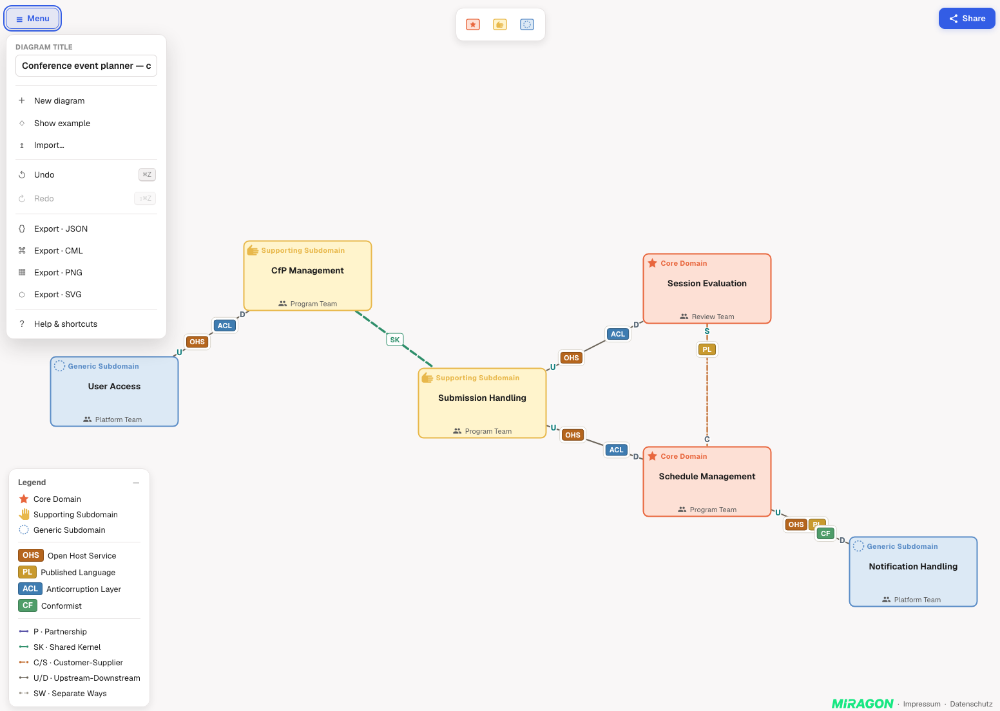

# Context Maps Modeler — Web App

[](https://github.com/Miragon/context-maps-modeler/blob/main/LICENSE)

The browser editor for strategic Domain-Driven Design [Context Maps](https://contextmapper.org/)
diagrams — a Vite + React app built on the shared
[`@miragon/context-maps-renderer`](../../packages/renderer) core. An
**Excalidraw-style full-bleed canvas** with floating chrome: no header bar, the tools sit over the
diagram. **No backend** — everything is local, and a diagram is shared by encoding it into the URL.



## Highlights

- **Full-bleed canvas + floating chrome.** A floating **Palette** with a lasso tool
  top-centre, an element-bound **context pad** floating next to the selection and the notation
  **Legend** bottom-left (all from the renderer), a **☰ Menu** top-left and a **Share** button
  top-right.
- **Edit by direct manipulation.** Drag from the palette to create and move contexts, connect
  them with relationships, inline-edit labels, undo/redo — all from the diagram-js core.
- **Share via URL, no server.** **Share** copies a self-contained link — the whole diagram is
  LZ-compressed into the URL hash (`#d=…`). Opening that link restores the diagram.
- **Autosave.** Every edit is debounced to `localStorage` and mirrored into the address bar, so a
  reload brings your work back.
- **Import / export.** Open a `.cm.json` or Context Mapper `.cml` file, export **JSON**, **CML**, **SVG**
  or **PNG** (rasterised at 2×), start a **New** diagram, or load the bundled **example** context map.
- **Offline-friendly.** No CDN calls; the type fallback degrades cleanly to the system sans stack.

## Run it

From the repo root (Node ≥ 22.13):

```bash
npm install
npm run dev:webapp            # stable per-worktree https://<worktree>.context-maps-modeler.localhost
```

`npm run dev:webapp` serves the app via [Portless](https://portless.sh) at a stable per-worktree
`.localhost` URL (needs Node ≥ 24 + a one-time `npx portless service install` — see
[`CONTRIBUTING.md`](../../CONTRIBUTING.md)). For plain Vite on a fixed port instead:

```bash
npm run dev:webapp:plain      # http://localhost:5181
```

Production build (also what Netlify runs):

```bash
npm run build:webapp          # → apps/webapp/dist
```

On first load the app shows, in priority order, a diagram from a **shared link** (`#d=…`), then the
**autosaved** diagram from `localStorage`, then the bundled **example**.

## How it works

A thin React shell over the framework-agnostic modeler:

- **`DiagramCanvas`** mounts the `Modeler` from
  [`@miragon/context-maps-renderer`](../../packages/renderer) into a `<div>` and loads the initial
  document.
- **State** — a React context mirrors modeler events (selection, undo/redo availability, title,
  revision) into React; a small **Zustand** store holds UI-only state (help dialog, welcome card) and toasts.
  The diagram itself stays owned by diagram-js, not by React.
- **Sharing / persistence** — `serializeDocument()` →
  `LZString.compressToEncodedURIComponent` → `#d=…`. Autosave writes the same to `localStorage`
  (debounced ~600 ms) and to the address bar; very large diagrams skip the hash and rely on
  `localStorage`.
- **Export** — JSON via `serializeDocument()`; SVG via `modeler.saveSVG()`; PNG by rasterising that
  SVG onto a canvas.

The renderer and schema-model packages are aliased to their **TypeScript source** in `vite.config.ts`,
so there is no separate library build step — `npm run dev:webapp` and the Netlify build compile the
whole monorepo from source.

## Deployment

Deployed on **Netlify** (config in [`netlify.toml`](../../netlify.toml)): build `npm run build:webapp`,
publish `apps/webapp/dist`, Node 22, with an SPA catch-all redirect to `index.html` (hash-based
routing).

## License

[MIT](../../LICENSE).
